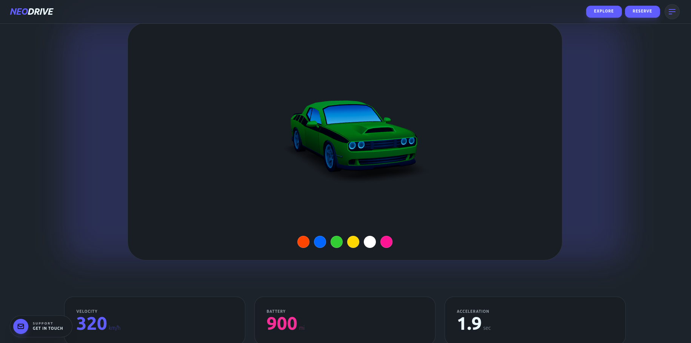
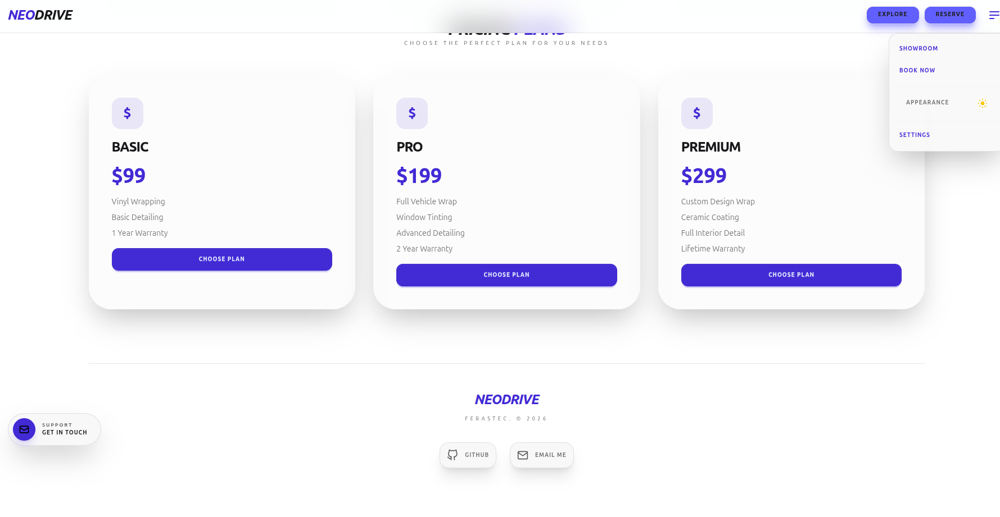
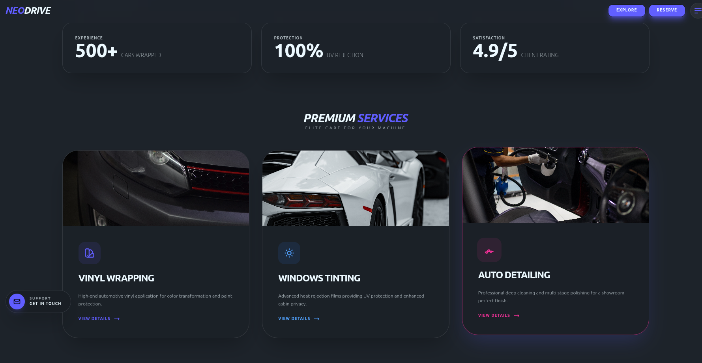

# NEODRIVE | 3D Interactive Dashboard

## 🚗 Über das Projekt

NEODRIVE ist ein modernes, interaktives Dashboard für ein fiktives High-End-Automotive-Servicecenter. Das Hauptziel dieses Projekts war es, eine immersive Benutzererfahrung (User Experience) zu schaffen, indem ein interaktives 3D-Modell mit funktionalen UI-Komponenten kombiniert wird.

## 💡 Inspiration

Die Inspiration für dieses Projekt stammt von modernen Elektrofahrzeug-Schnittstellen (wie Tesla und Lucid Air) sowie von futuristischen Cyberpunk-Ästhetiken. Ich wollte zeigen, wie Web-Technologien genutzt werden können, um statische Landingpages in dynamische Erlebnisse zu verwandeln.

## 🛠️ Verwendete Technologien

- **Vite**: Als extrem schneller Frontend-Build-Tool.
- **Tailwind CSS**: Für das Utility-First-Styling und responsives Design.
- **DaisyUI**: Für semantische Komponenten und das Theme-Management (Dark/Light Mode).
- **Model-Viewer**: Zur Einbindung und Steuerung des interaktiven 3D-Automodells.
- **AOS (Animate On Scroll)**: Für flüssige Scroll-Animationen.

## ✨ Hauptfunktionen

- **3D-Konfigurator**: Benutzer können die Farbe des Autos in Echtzeit ändern.
- **Dynamic Theme Switch**: Vollständige Unterstützung für Dark- und Light-Mode über DaisyUI.
- **Interaktives Booking-System**: Ein animiertes Reservierungsformular, das über die UI gesteuert wird.
- **Service-Details**: Dynamische Modals, die detaillierte Informationen zu den angebotenen Dienstleistungen (Vinyl Wrapping, Tinting, Detailing) anzeigen.

## 📐 Best Practices & Semantik

- Verwendung von **semantischem HTML5** (`<header>`, `<main>`, `<section>`, `<footer>`).
- **Responsive Design**: Die Seite ist für Mobilgeräte, Tablets und Desktops optimiert.
- **Clean Code**: Trennung von Logik (JS) und Design (Tailwind/CSS).
- **Barrierefreiheit**: Kontrastreiche Texte und klare Strukturierung.

## 📸 Screenshots

_(Hier kannst du deine Screenshots einfügen)_

1. **Dark Mode View:** `
2. **Light Mode View:** `
3. **3D Interaction:** `

## 🚀 Installation

1. Repository klonen.
2. `npm install` ausführen.
3. `npm run dev` starten.
